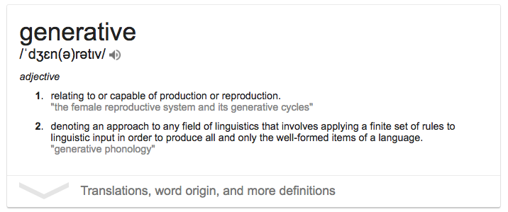

# Awesome Haxe Generative
A collection of awesome Haxe generative libraries, resources and shiny things.

Like [generative art](https://en.wikipedia.org/wiki/Generative_art), [generative music](https://en.wikipedia.org/wiki/Generative_music) or other forms of [generative](https://en.wikipedia.org/wiki/Generative) (even if they are not mentioned)

Everybody is allowed to contribute, if they are "attracted" by the word **Generative**.
Any library that serves a purpose in your work, are allowed to be mentioned here. If you are the maintainer of the library a working example would be appreciated. If you worked with a library in your work, a snippet of code will be appreciated.

# Prototype JavaScript

- [hx-quicksettings](https://github.com/markknol/hx-quicksettings) Haxe extern classes for [quicksettings](https://github.com/bit101/quicksettings)

# Processing 

- [hxProcessing](https://github.com/andyli/hxProcessing) Use Processing in Haxe's Java target

# Color

- [thx.color](https://github.com/fponticelli/thx.color) General purpose color library for Haxe
- [hxColorToolkit](https://github.com/andyli/hxColorToolkit) Haxe library for color conversion and color scheme generation.

# Contents

- [generative-grammar](https://github.com/anissen/generative-grammar) Parser and generator for a simple generative grammar. 
- [traceryhx](https://github.com/chiguire/traceryhx) A story-grammar generation library.

# Noise / Random

- [libnoise](https://github.com/memilian/libnoise) A Haxe port of libnoise, the coherent noise library. 
- [hxrandom](https://github.com/jasononeil/hxrandom) Extremely simple helper library to easy picking random numbers in Haxe.

# Pattern

- [hxDelaunay](https://github.com/azrafe7/hxDelaunay) Delaunay triangulations, Voronoi, convex hull and more. 
